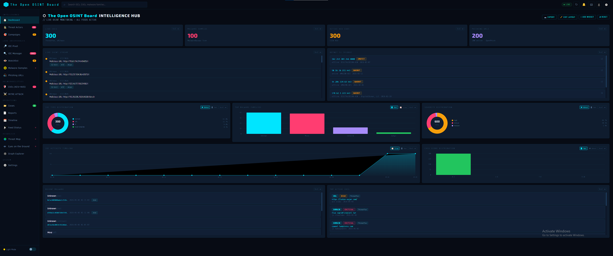
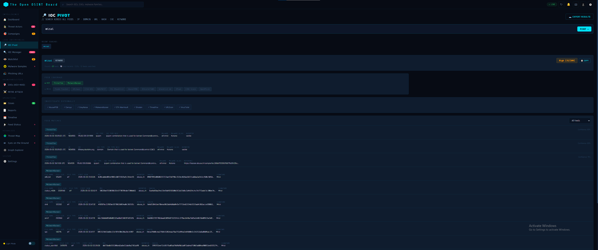
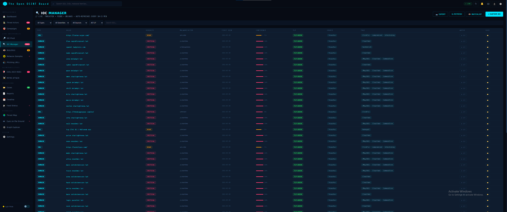
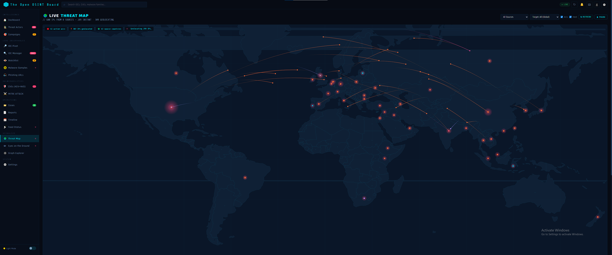
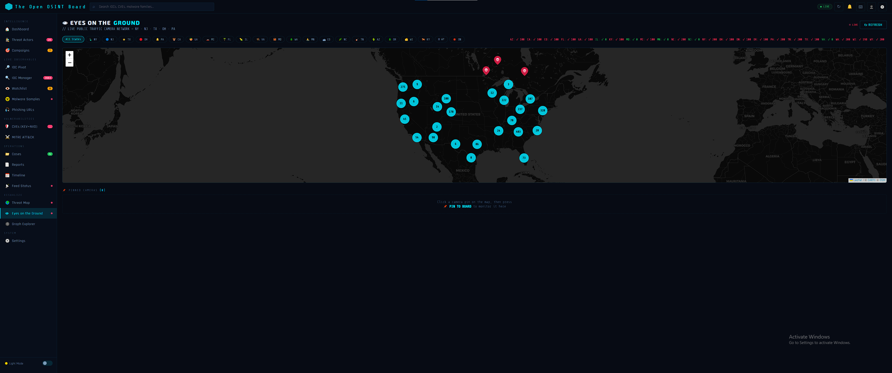
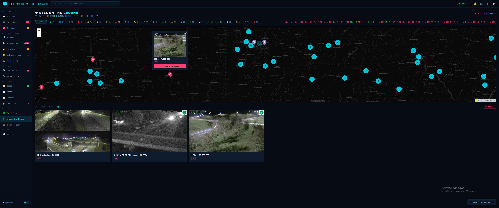
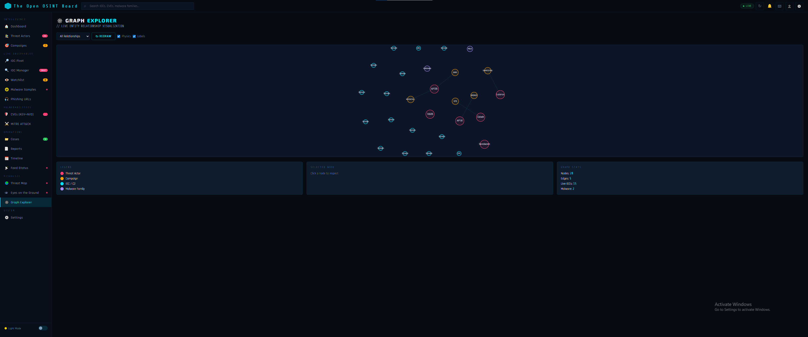
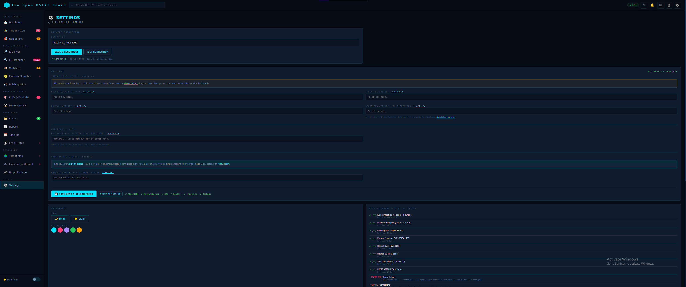
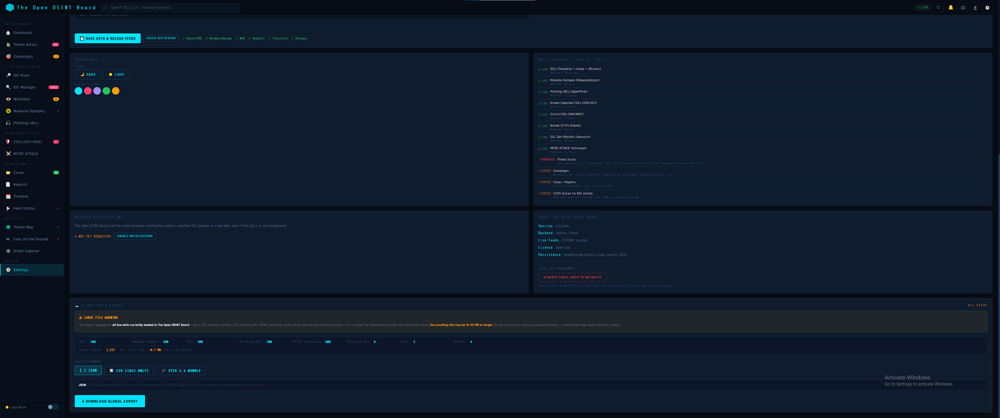

# The Open OSINT Board

**A fully self-hostable, browser-based open source intelligence dashboard.**

The Open OSINT Board (TOOB) aggregates live threat intelligence from 9 public OSINT feeds into a single, unified interface — no cloud account, no subscription, no telemetry. Run it locally on your own machine in under two minutes.

> **Developed by Lucent Grid.** TOOB is not affiliated with, endorsed by, or partnered with any of the third-party data sources it connects to. All external feeds are publicly available open source intelligence. Any paid tiers offered by those vendors are entirely at the user's discretion, and all payments go directly to those respective vendors.

---

## Table of Contents

- [What It Does](#what-it-does)
- [Quick Start](#quick-start)
- [Manual Start](#manual-start)
- [API Keys — Setup Guide](#api-keys--setup-guide)
- [Navigating the App](#navigating-the-app)
- [Tab Reference](#tab-reference)
- [Search](#search)
- [API Rate Limits](#api-rate-limits)
- [How It Works — Technical Overview](#how-it-works--technical-overview)
- [Architecture](#architecture)
- [Security Notes](#security-notes)
- [Requirements](#requirements)

---

## What It Does

TOOB pulls live data from public OSINT sources and presents it in one place:

- **IOC feeds** — malicious IPs, domains, URLs, and file hashes from ThreatFox, Feodo Tracker, and URLhaus
- **Malware samples** — recent submissions to MalwareBazaar with hashes, family tags, and file metadata
- **Phishing URLs** — verified active phishing URLs from PhishTank
- **Vulnerabilities** — critical CVEs from NIST NVD + the CISA Known Exploited Vulnerabilities catalog
- **MITRE ATT&CK** — the full enterprise technique and tactic database, searchable and filterable
- **Threat actors** — curated actor profiles enriched with live IOC counts from ThreatFox
- **Threat map** — live geolocation of active C2 infrastructure plotted on a world map
- **Traffic cameras** — real-time DOT camera feeds across 40+ US states via Road511
- **Relationship graph** — visual force-directed graph linking actors, campaigns, IOCs, and malware families

Everything runs locally. Your data stays on your machine.

---

## Screenshots

### Dashboard

*Live widget dashboard — event stream, charts, botnet C2 feed, and mini threat map*

---

## Quick Start
IMPORTANT: 
- **python3 is required in order to run the backend server
- **Windows: Run cmd in Administrator mode then type in the following command: winget install python3
- **Linux: sudo apt install python3

**Windows:**
```
Double-click start.bat
```
The script finds Python, installs dependencies, starts the backend, and opens the dashboard in your browser automatically.

**macOS / Linux:**
```bash
chmod +x start.sh
./start.sh
```

The dashboard will open at `frontend/index.html`. The backend runs at `http://localhost:5000`.

---

## Manual Start

```bash
# Install dependencies once
pip3 install flask flask-cors requests apscheduler certifi tzdata

# Start the backend
cd backend
python3 server.py

# Open the frontend in your browser
open frontend/index.html        # macOS
xdg-open frontend/index.html   # Linux
start frontend/index.html       # Windows
```

---

## API Keys — Setup Guide

Most of TOOB's core feeds work without any API key at all. Keys unlock higher rate limits and additional features. **Each user should obtain their own keys** — sharing keys across multiple deployments will drain rate limits quickly and risks account suspension.

Keys are entered in the app under **Settings → API Keys**, and saved to `backend/config.json` on your machine.

---

### Which Feeds Need a Key?

| Feed | Key Required? | Without Key | With Key |
|------|--------------|-------------|----------|
| MalwareBazaar (abuse.ch) | Optional | Works, lower priority | Full access |
| URLhaus (abuse.ch) | Optional | Works | Full access |
| ThreatFox (abuse.ch) | Optional | Works | Full access |
| AbuseIPDB | **Required** for Threat Map | No IP geo enrichment | 1,000 checks/day (free) |
| NVD / NIST | Optional | 5 requests/30s | 50 requests/30s |
| Road511 | **Required** for cameras | No camera feeds | 40+ states of DOT cameras |
| CISA KEV | None — always free | Full access | — |
| Feodo Tracker | None — always free | Full access | — |
| SSL Blacklist | None — always free | Full access | — |
| PhishTank | None — always free | Full access | — |
| MITRE ATT&CK | None — always free | Full access | — |

---

### Getting Each Key

#### abuse.ch — MalwareBazaar, URLhaus, ThreatFox

All three abuse.ch feeds use the **same API key**.

1. Go to [https://abuse.ch/](https://abuse.ch/) and click **Login / Register**
2. Create a free account
3. Go to your profile and copy your API key
4. In TOOB → Settings → API Keys, paste the key into each of the three abuse.ch fields

#### AbuseIPDB

Powers the Threat Map's IP geolocation and IOC reputation enrichment.

1. Register at [https://www.abuseipdb.com/register](https://www.abuseipdb.com/register)
2. Go to **Account → API** and create a key
3. Copy it into Settings → API Keys → AbuseIPDB

Free tier: **1,000 IP checks per day.** Paid plans are available directly at abuseipdb.com and increase the daily limit significantly. All purchases go directly to AbuseIPDB — TOOB and Lucent Grid are not affiliated with them.

#### NVD / NIST National Vulnerability Database

The CVE feed works without a key, but a key gives 10× the request rate.

1. Request a free key at [https://nvd.nist.gov/developers/request-an-api-key](https://nvd.nist.gov/developers/request-an-api-key)
2. Approval is automatic and near-instant
3. Paste it into Settings → API Keys → NVD

Without key: 5 requests per 30 seconds. With key: 50 requests per 30 seconds.

#### Road511 — Eyes on the Ground Camera Feeds

One key covers all 40+ US states.

1. Register at [https://road511.com](https://road511.com)
2. Obtain your API key from your account dashboard
3. Paste it into Settings → API Keys → Road511

Road511 normalises every state DOT camera API into a single endpoint. Pricing and tier details are available on their website. All payments go directly to Road511 — TOOB and Lucent Grid are not affiliated with them.

---

### Saving Keys

After pasting your keys in Settings → API Keys, click **SAVE KEYS & RELOAD FEEDS**. The keys are written to `backend/config.json` and the feeds restart immediately. You can verify which keys are active by clicking **CHECK KEY STATUS**.

---

## Navigating the App

The left sidebar is divided into five sections:

| Section | Tabs |
|---------|------|
| **Intelligence** | Dashboard, Threat Actors, Campaigns |
| **Live Observables** | IOC Pivot, IOC Manager, Watchlist, Malware Samples, Phishing URLs |
| **Vulnerabilities** | CVEs (KEV+NVD), MITRE ATT&CK |
| **Operations** | Cases, Reports, Timeline, Feed Status |
| **Visualize** | Threat Map, Eyes on the Ground, Graph Explorer |

The global search bar at the top accepts any IOC, CVE ID, malware family name, domain, IP, or hash and routes it directly to the IOC Pivot for a cross-feed search.

---

## Tab Reference

### Dashboard

The main hub. Displays a live-updating grid of configurable widgets:

- **Live Event Stream** — real-time unified feed of all incoming OSINT events
- **Botnet C2 (Feodo)** — active botnet command-and-control IPs with ASN and status
- **IOC Type Distribution** — donut/bar chart breaking down IOC types (Domain, URL, IP, Hash)
- **Top Malware Families** — bar chart of most-seen malware families in the live feed
- **Severity Distribution** — breakdown of IOC severity levels across the feed
- **IOC Activity Timeline** — line chart showing IOC volume over time
- **CVSS Score Distribution** — histogram of CVE severity scores
- **Recent Malware** — latest MalwareBazaar submissions with hash and family
- **Top Active IOCs** — highest-confidence current indicators from the live feed
- **Mini Threat Map** — compact world map with country outlines and live C2 location dots

**Customising your dashboard:**
- Click the **pencil icon** (top right of the page) to enter Edit Mode
- Drag widgets to reorder them
- Click the column toggle on each widget header to resize between narrow and wide
- Click **+ ADD WIDGET** to add any available widget type
- Click the chart type buttons (donut / bar / line) on chart widgets to switch visualisation style
- Click **× REMOVE** on a widget to remove it
- Your layout is saved per-user to the backend and persists across refreshes, logouts, and different browsers on the same server

---

### Threat Actors

A curated database of known threat actor groups, enriched live with IOC counts from ThreatFox on every poll cycle.

- Filter by type (APT, Cybercriminal, State-Sponsored, Hacktivist), severity, and TLP classification
- Search by actor name or alias
- The live IOC count column shows how many current ThreatFox IOCs match that actor, with the specific malware families driving the match shown beneath
- Click any actor row to open the full detail modal:
  - Description, all aliases, origin, and severity
  - Known malware families list — active families (seen in current feed) highlighted with a dot indicator
  - Live matched IOC list with type and family label (up to 20 entries)
  - Associated campaigns
- Add new actors with **+ NEW ACTOR**

Enrichment works by matching each actor's known malware family list against the live ThreatFox feed and updates automatically on each 60-second IOC poll.

---

### Campaigns

Tracks threat campaigns — active, under monitoring, and historical.

- Click any campaign card to open the full detail modal:
  - Full description and start date
  - Actor attribution — actor name links to their profile in the Threat Actors tab
  - Live IOC count and matched malware families from ThreatFox (via attributed actor)
  - Reported IOC count vs live feed match count displayed side by side
  - Linked cases from your Operations workspace (matched by overlapping tags and actor keywords)
  - Edit all fields and Delete with confirmation
- Add new campaigns with **+ NEW CAMPAIGN**

---

### IOC Pivot

The core cross-feed search and enrichment tool. Type any of the following and press Enter or click **PIVOT →**:

- **IP address** — matched against ThreatFox, Feodo, and URLhaus; geolocated via ip-api.com; reputation scored via AbuseIPDB
- **Domain** — matched against ThreatFox and URLhaus
- **URL** — matched against URLhaus and PhishTank
- **File hash** (MD5 or SHA256) — matched against MalwareBazaar and ThreatFox
- **CVE ID** (e.g. CVE-2024-12345) — matched against NVD and CISA KEV
- **Malware family name** — matched across all feeds simultaneously

Results show all feed matches at once, elapsed search time, and the number of feeds searched. Export results as JSON, CSV, or STIX 2.1 directly from the results panel.

The global search bar at the top of every page routes here. After submitting, the search bar dims the query text briefly to confirm the search fired before clearing.

### IOC Pivot — Cross-Feed Search

*Searching across all feeds simultaneously — matched IOCs, malware samples, feed coverage, and external pivot links*

---

### IOC Manager

A live, filterable table of all current IOCs aggregated from ThreatFox, Feodo Tracker, and URLhaus — up to 300 records at a time.

- Filter by type (IP, Domain, URL, Hash), severity, and source feed
- Search by value or actor tag within the current results
- Click any IOC row to expand a full enrichment detail panel: geo data, ASN, AbuseIPDB confidence score, malware family, and feed metadata
- From the detail panel, link the IOC to an existing Case or add it to your Watchlist
- Export the full table as CSV, JSON, or STIX 2.1

### IOC Manager

*Live filterable table of 300+ IOCs aggregated from ThreatFox, Feodo, and URLhaus*

---

### Watchlist

A personal monitoring list for values you want to track against the live feed.

- Add any IP, domain, hash, or CVE ID manually, or add directly from the IOC Manager detail panel
- Every 60 seconds when the IOC feed refreshes, TOOB scans all incoming IOCs for watchlist matches
- On a match: an alert is logged to the Watchlist tab, a toast notification fires in-app, and — if browser notification permission is granted — a native OS notification fires even when the tab is in the background
- Clicking a browser notification focuses the window and navigates directly to the Watchlist tab
- Grant notification permission in **Settings → Browser Notifications**, or the first time a match occurs you will be prompted automatically

---

### Malware Samples

Live feed from MalwareBazaar showing recent sample submissions.

- Columns: filename, file type, malware family signature, SHA256 hash, first seen date, reporter, tags
- Click any row to expand full sample details: MD5, file size, all tags, reporter comment
- Filter by file type; search by hash or signature name
- Export the visible table

---

### Phishing URLs

Verified active phishing URLs from PhishTank, refreshing every 60 minutes.

- Each entry shows the phishing URL, submission date, and verification status
- Filter by status; search by URL or target site
- Useful for cross-referencing URLs found in email headers or logs

---

### CVEs (KEV + NVD)

Combined vulnerability intelligence from two authoritative sources:

- **CISA KEV** — the Known Exploited Vulnerabilities catalog: CVEs confirmed to be actively exploited in the wild, maintained by the Cybersecurity and Infrastructure Security Agency. This is the most operationally relevant list for prioritising patches.
- **NIST NVD** — all critical-severity CVEs (CVSS 9.0+) published in the last 30 days from the National Vulnerability Database

Each entry shows CVE ID, CVSS score and vector, severity badge, affected product or component, description, and publication date. Click any CVE to open the full detail panel with references and weakness (CWE) classifications. Filter by source feed, severity, and CVSS score range. Export as CSV or JSON.

---

### MITRE ATT&CK

The full MITRE ATT&CK Enterprise technique database, fetched from the official MITRE CTI repository and refreshed every 30 minutes.

- Browse all techniques with tactic, sub-technique flag, platform tags (Windows, Linux, macOS, Cloud, etc.), and full description
- Filter by tactic (Initial Access, Execution, Persistence, Privilege Escalation, Defense Evasion, Credential Access, Discovery, Lateral Movement, Collection, Command and Control, Exfiltration, Impact)
- Search by technique name, ID (e.g. T1059), or keyword
- Click any technique to open a detail panel with full description and a direct link to attack.mitre.org

---

### Cases

An internal incident response workspace for tracking active investigations.

- Create cases with title, severity, TLP, status (Active / Monitoring / Closed), assignee, description, and tags
- Add a checklist of tasks to each case and mark them complete as work progresses
- Link live IOCs from the feed directly to a case from the IOC Manager detail panel — value, type, severity, source, and timestamp are all recorded
- Switch case status between Active, Monitoring, and Closed directly from the case detail modal
- Filter the case list by TLP classification
- Cases persist in browser localStorage

---

### Reports

An internal threat intelligence report library for storing and cross-referencing written assessments.

- Store reports with title, type (Threat Report, Periodic Report, Executive Brief, Vulnerability Report), author, TLP, severity, summary, page count, and tags
- Click any report card to open the full detail modal:
  - Full summary and author
  - Linked campaigns — matched by tag overlap and title keyword
  - Linked cases — matched by the same logic
  - Clicking a linked campaign or case navigates directly to that record
  - Edit all fields and Delete with confirmation
- Reports persist in browser localStorage

---

### Timeline

A chronological event stream across all data types in your workspace.

- Toggle which event types to show: IOCs, CVEs, Cases, Campaigns, Reports
- Filter by time range: last 7 days, 30 days, 90 days, or all time
- Sort ascending or descending
- Useful for building a timeline of an incident or correlating activity patterns across different data types

---

### Feed Status

A real-time health dashboard for all backend data feeds.

- Shows current status (OK / loading / error / rate-limited), last successful update time, and current record count for every feed
- Displays any notes from the backend (e.g. "Rate limited — using cached index", or "NVD API unreachable — check your NVD API key")
- The first place to check when a feed appears stale or missing data

---

### Threat Map

An interactive world map plotting active malicious infrastructure from the live IOC feed.

- Country borders rendered from embedded Natural Earth polygon data — no external fetch, works fully offline
- Dots represent geolocated malicious IPs from ThreatFox and Feodo Tracker, coloured by severity
- Click any dot to see the IP address, malware family, ASN, and country
- The Dashboard also contains a compact mini version of this map as an optional widget

  ### Live Threat Map

*Active malicious infrastructure geolocated in real time across hundreds of IPs from 8 OSINT sources*

---

### Eyes on the Ground

Live DOT traffic camera feeds from 40+ US states via the Road511 API.

- Requires a Road511 API key (see API Keys section above)
- Browse cameras by state/jurisdiction
- Pin individual cameras to your board for persistent quick access
- Camera images refresh automatically
- Primarily useful for physical situational awareness during infrastructure events, natural disasters, or field operations

### Eyes on the Ground — Camera Map

*DOT traffic camera network across 40+ US states — click any marker to preview and pin*

### Eyes on the Ground — Pinned Feeds

*Pinned cameras showing live road feeds*

---

### Graph Explorer

An interactive force-directed graph that visualises relationships between threat entities in real time.

- **Red nodes** — Threat actors from your database
- **Cyan nodes** — Live IOCs from the current ThreatFox/Feodo feed
- **Purple nodes** — Malware family signatures from MalwareBazaar
- **Amber nodes** — Campaigns from your database
- Edges represent relationships: actor runs campaign, actor linked to IOC via malware family match
- Toggle **Physics** to enable/disable force simulation (nodes repel and settle naturally)
- Toggle **Labels** to show/hide node name labels
- Filter the graph by entity type using the dropdown: All, IOCs only, Actors + Campaigns, Malware only
- Click any node to inspect its details in the side panel
- Press **↻ REDRAW** to re-randomise node positions

### Graph Explorer

*Force-directed relationship graph linking threat actors, campaigns, live IOCs, and malware families*

---

### Settings

- **Backend Connection** — change the backend URL if running TOOB on a remote server (e.g. `http://192.168.1.100:5000`)
- **API Keys** — enter, save, and check the status of all API keys
- **Appearance** — toggle between dark mode and light mode
- **Browser Notifications** — view current permission status and enable OS-level watchlist notifications
- **Data Coverage** — shows live / enriched / static status for every feed at a glance
- **Export** — global export of all currently loaded live data to a single JSON, CSV, or STIX 2.1 file
- **About** — version and build information

### Settings — API Keys & Configuration

*API key management, backend connection, and data coverage status*

### Settings — Notifications & Export

*Browser notification controls, appearance, and global data export*

---

## Search

The global search bar (top of every page) accepts any indicator, identifier, or name. Press **Enter** to submit. The bar dims the search term briefly to confirm the query fired, then routes to the **IOC Pivot** tab where all feeds are searched simultaneously and results are displayed together.

For filtered browsing within a specific feed, each tab has its own per-page search field and filter controls independent of the global search.

---

## API Rate Limits

TOOB operates within the free tier of each data source by default. Some sources impose daily or per-minute request caps. Here is a summary of the key limits you may encounter:

| Source | Free Limit | Paid Option |
|--------|-----------|-------------|
| **AbuseIPDB** | 1,000 IP checks / day | Paid plans available at abuseipdb.com — increase daily quota |
| **NVD / NIST** | 5 req / 30s (no key) · 50 req / 30s (with free key) | Key is free — request one at nvd.nist.gov |
| **abuse.ch** (MalwareBazaar, ThreatFox, URLhaus) | Generous free tier; key improves queue priority | No formal paid tier |
| **PhishTank** | 45 requests / minute | No paid tier |
| **ip-api.com** (geolocation) | 45 requests / minute | Paid plans at ip-api.com |
| **MITRE ATT&CK** | No rate limit (CDN-hosted) | N/A |
| **CISA KEV** | No rate limit | N/A |
| **Feodo Tracker** | No rate limit | N/A |
| **Road511** | Varies by plan | Paid tiers available at road511.com |

When a rate limit is hit, TOOB degrades gracefully — the affected feed shows a note in Feed Status and falls back to the most recent cached data where available. AbuseIPDB specifically caches its last successful IP index to disk and serves that during rate-limited periods so the Threat Map continues to function.

> **Lucent Grid and The Open OSINT Board are not affiliated with any of the above services, do not receive any portion of payments made to them, and make no guarantees regarding their pricing, availability, or terms of service.** All paid tier decisions are entirely at the discretion of the individual user.

---

## How It Works — Technical Overview

### Backend — `server.py`

The backend is a single Python file running a **Flask** web server on `localhost:5000`. It acts as a proxy between the browser and all external OSINT APIs — necessary because browsers block cross-origin requests (CORS), and some APIs require server-side authentication headers that must not be exposed in client-side JavaScript.

**Feed fetching:** Each data source has a dedicated fetch function. An **APScheduler** background scheduler runs these on staggered intervals (10 minutes for MalwareBazaar and URLhaus, 60 minutes for PhishTank, 30 minutes for MITRE ATT&CK, and so on). All feed data is held in a shared `cache` dictionary in memory. A `threading.Lock` protects the cache from race conditions during concurrent browser requests and background refreshes. Nothing is written to disk except user accounts, session tokens, dashboard layouts, and two fallback caches (AbuseIPDB IP index and PhishTank data) that allow the app to serve useful data after a restart before the first fresh fetch completes.

**Authentication:** User accounts are stored as salted SHA-256 hashes in `backend/data/users.json`. On login, the server issues a session token saved to `backend/data/tokens.json`. Every authenticated request passes the token in the `X-Auth-Token` header; the server validates it before serving protected endpoints. Tokens expire after a configurable duration.

**Per-user dashboard layouts:** When a user saves their dashboard, the frontend POSTs the layout array to `/api/layout`. The server writes it to `backend/data/layouts/<username>.json`. On the next login — from any browser — the frontend fetches that file and restores the user's exact widget arrangement.

**Camera feeds:** The Road511 integration fetches camera metadata and snapshot image URLs for each configured US state jurisdiction and caches them per-jurisdiction. The frontend requests cameras by state; the backend proxies the image URLs to avoid CORS issues with state DOT servers.

---

### Frontend — `index.html`

The entire frontend is a **single HTML file** — roughly 7,800 lines — containing all page structure, CSS styling, and JavaScript application logic together. There is no build step, no bundler, no npm, no framework dependencies. Opening the file in a browser is sufficient.

**Page architecture:** Each tab in the sidebar corresponds to a `<div>` with a `data-page` attribute. The `navTo(page)` function shows the selected page div and hides all others, giving the feel of a multi-page application without any routing library or page reloads. A `pageRenderers` map triggers a tab-specific re-render on entry — for example, navigating to the Dashboard calls `refreshDashCharts()` so canvas charts always redraw at the correct dimensions after being hidden.

**Data flow:** The frontend polls the backend on a schedule: IOCs, malware samples, and phishing data every 60 seconds; vulnerabilities every 5 minutes; MITRE ATT&CK every 30 minutes. All live data is stored in a `liveData` object in memory. Render functions read from `liveData` and write directly to the DOM via `innerHTML` — no virtual DOM, no reactivity system.

**Dashboard widget system:** The `WIDGET_CATALOG` object defines every available widget type with its title, default column width, and available chart types. The `dashLayout` array describes the current arrangement. `renderDashGrid()` loops through `dashLayout`, creates a container element per widget, and calls the appropriate draw function. Charts are drawn on HTML5 `<canvas>` elements using the Canvas 2D API — no charting library required.

**Persistence:** User workspace data (cases, campaigns, reports, actors, watchlist, custom IOCs) is stored in browser `localStorage` under `toob_db_v1` as a serialised JSON object. `saveDB()` is called after every mutation. Dashboard layouts and session tokens are stored in separate `localStorage` keys as well as on the backend server.

**Threat Map country borders:** Rather than fetching a TopoJSON file from a CDN at runtime (which would fail in restricted network environments), country polygon data extracted from Natural Earth is embedded directly in the HTML as the `WORLD_RINGS` JavaScript constant. This means the map renders correctly with no internet dependency and no external request.

---

### Design Philosophy

TOOB was built around one principle: **minimal setup, maximum utility.** A user should be able to download the project, double-click `start.bat`, and have a fully operational threat intelligence dashboard in under two minutes — no Docker, no database, no cloud account, and no configuration files to edit before first use.

The single-file frontend means nothing needs to be compiled, transpiled, or bundled. The Python backend's only dependencies are five widely-available packages that install in seconds. The project can be zipped, sent over email, or copied to a USB drive and run on any machine with Python 3.8+.

---

## Architecture

```
toob/
├── start.bat                  <- Windows one-click launcher
├── start.sh                   <- macOS/Linux one-click launcher
├── backend/
│   ├── server.py              <- Flask proxy server (port 5000)
│   ├── requirements.txt       <- Python dependencies
│   ├── config.json            <- API keys (user-supplied, gitignored)
│   └── data/
│       ├── users.json             <- Hashed user accounts
│       ├── tokens.json            <- Active session tokens
│       ├── layouts/               <- Per-user dashboard layouts
│       │   └── <username>.json
│       ├── abuseipdb_index.json   <- Cached IP reputation index
│       └── phishing_cache.json    <- Cached PhishTank data
└── frontend/
    └── index.html             <- Complete single-file dashboard
```

---

## Security Notes

- The backend runs on localhost — **never expose port 5000 to the internet** without adding authentication middleware and HTTPS termination
- All API calls are outbound-only; no inbound data is accepted from external sources
- Feed data is held in memory; only user accounts, session tokens, and dashboard layouts are written to disk
- API keys are stored in `backend/config.json` — **add this file to `.gitignore`** before pushing to any repository
- User passwords are stored as salted SHA-256 hashes, never in plaintext
- Custom IOCs, watchlists, cases, campaigns, and reports persist in browser localStorage on the client machine

---

## Requirements

- Python 3.8 or higher
- A modern browser (Chrome, Firefox, Edge, Safari)
- An internet connection for live feed data
- Port 5000 available on localhost
